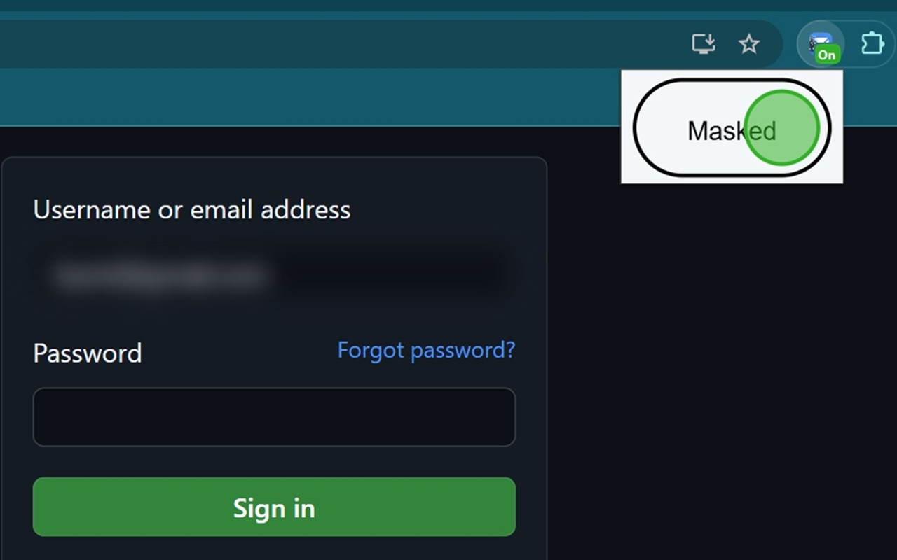

# Maskerade

Maskerade automatically blurs your email or username on login pages, protecting your information from prying eyes. Perfect for shared or public spaces, Maskerade helps keep your login details discreet, reducing the risk of accidental exposure.

Install now to add a layer of privacy to your login process with just one click!

## Install Extension

[Chrome Web Store](https://chromewebstore.google.com/detail/maskerade-blur-your-login/iaaijbjilkghmndjaoabbjkbfbkcbeaf?authuser=0&hl=en)